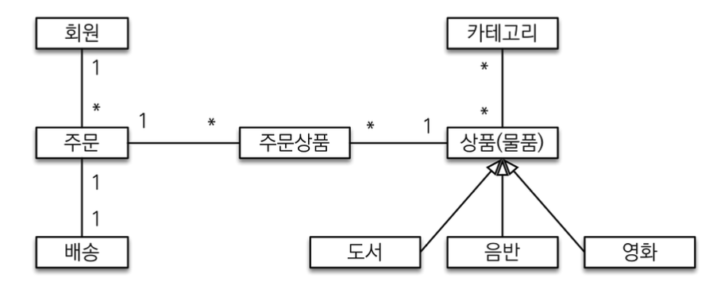
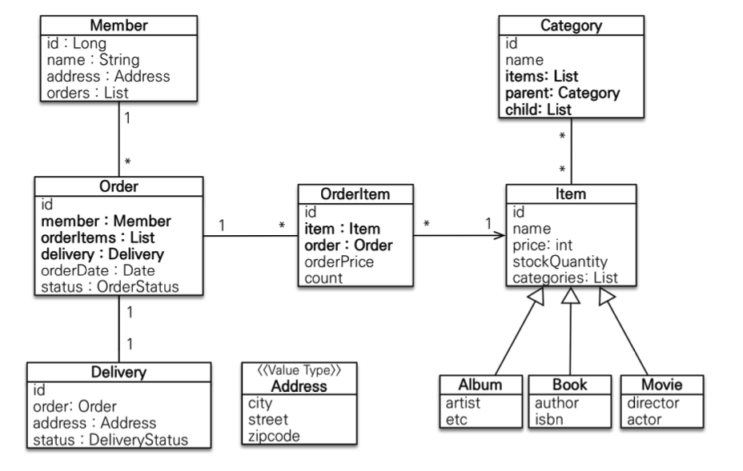

# JPA 주문 프로젝트

## 요구사항
- 회원 기능
  - 회원 등록
  - 회원 조회
- 상품 기능
  - 상품 등록
  - 상품 수정
  - 상품 조회
- 주문 기능
  - 상품 주문
  - 주문 내역 조회
  - 주문 취소
- 기타 요구사항
  - 상품은 재고 관리가 필요하다.
  - 상품의 종류는 도서, 음반, 영화가 있다.
  - 상품을 카테고리로 구분할 수 있다.
  - 상품 주문시 배송 정보를 입력할 수 있다.

## 도메인 모델과 테이블 설계

**회원,주문,상품의 관계**: 회원은 여러 상품을 주문할 수 있다. 그리고 한 번 주문할 때 여러 상품을 선택할 수 있으므로
주문과 상품은 다대다 관계다. 다대다 관계를 풀어내기위해 '주문상품'이라는 엔티티를 추가해서 일대다, 다대일 관계로 풀어냈다.

**상품분류**: 상품은 도서,음반,영화로 구분되는데 상품이라는 공통 속성을 사용하므로 상속구조로 표현했다.

**회원(Member):** 이름과 임베디드 타입인 주소( `Address` ), 그리고 주문( `orders` ) 리스트를 가진다.

**주문(Order):** 한 번 주문시 여러 상품을 주문할 수 있으므로 주문과 주문상품( `OrderItem` )은 일대다 관계다. 
주문은 상품을 주문한 회원과 배송 정보, 주문 날짜, 주문 상태( `status` )를 가지고 있다. 
주문 상태는 열거형을 사용했는데 주 문( `ORDER` ), 취소( `CANCEL` )을 표현할 수 있다.

**주문상품(OrderItem):** 주문한 상품 정보와 주문 금액( `orderPrice` ), 주문 수량( `count` ) 정보를 가지고 있다. 

**상품(Item)**: 이름, 가격, 재고수량( `stockQuantity` )을 가지고 있다. 상품을 주문하면 재고수량이 줄어든다. 
상품의 종류로는 도서, 음반, 영화가 있는데 각각은 사용하는 속성이 조금씩 다르다.

**배송(Delivery)**: 주문시 하나의 배송 정보를 생성한다. 주문과 배송은 일대일 관계다.

**카테고리(Category):** 상품과 다대다 관계를 맺는다. `parent` , `child` 로 부모, 자식 카테고리를 연결한다.

**주소(Address)**: 값 타입(임베디드 타입)이다. 회원과 배송(Delivery)에서 사용한다.

